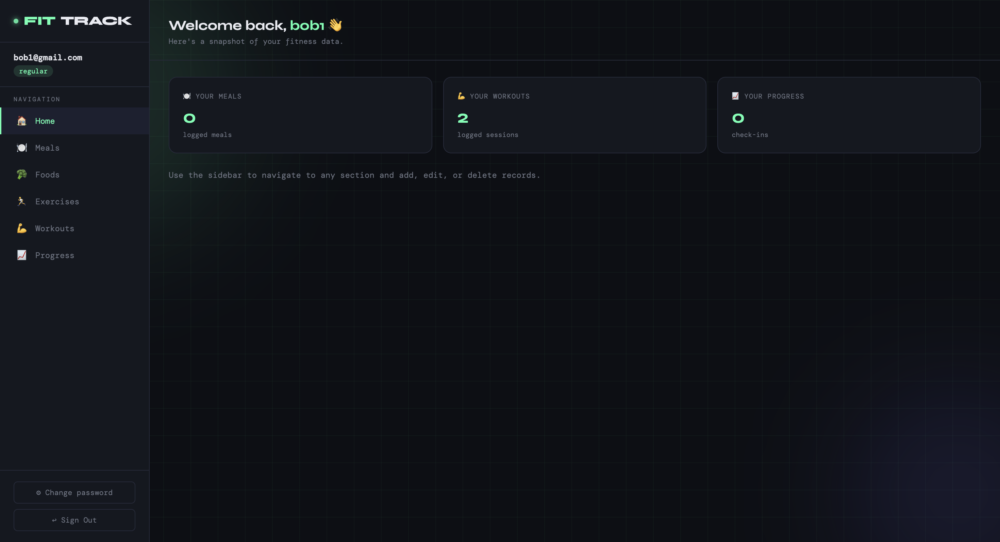
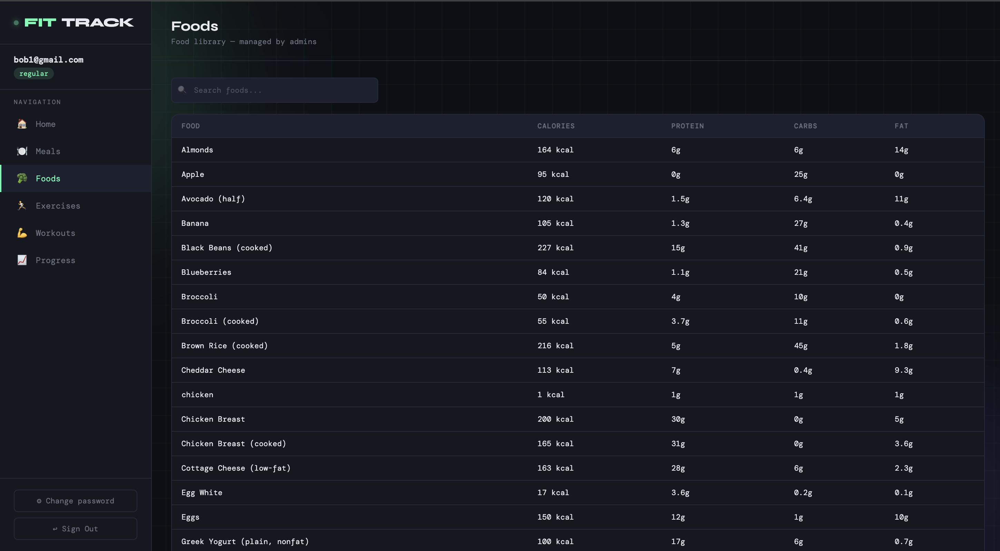
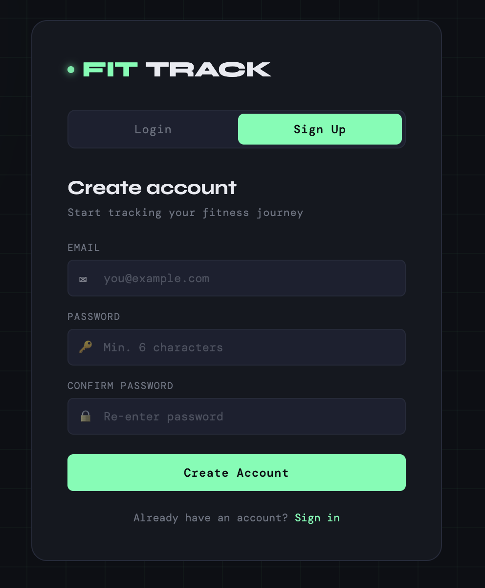

# 4604-Database-Project
---
Many gym-goers struggle to track their workouts and nutrition consistently. Most people rely on notes apps, spreadsheets, or memory, which leads to missing entries, duplicate data, and no easy way to look back at progress. Our system solves this by providing a centralized, database-driven platform where users can log and manage all their fitness and diet data in one place.

We built this for anyone trying to improve or maintain their health, from beginners just starting out to advanced athletes tracking detailed performance metrics. The core actions users perform are logging meals, recording workouts, and tracking body metrics over time. Without a structured system, it's nearly impossible to spot trends or make informed adjustments to training and diet.

One feature is making meals by using are available food options, which already has the appropriate calories and health metrics. Another is making workouts by using our available exercises which have the calories burned, and corresponding muscle group. Lastly, users can also track their progress by logging their weight, body fat, and any additional notes.

Look at some images of our site below:

